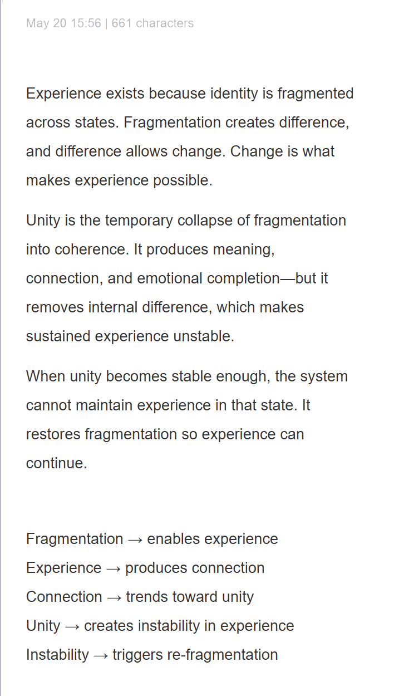
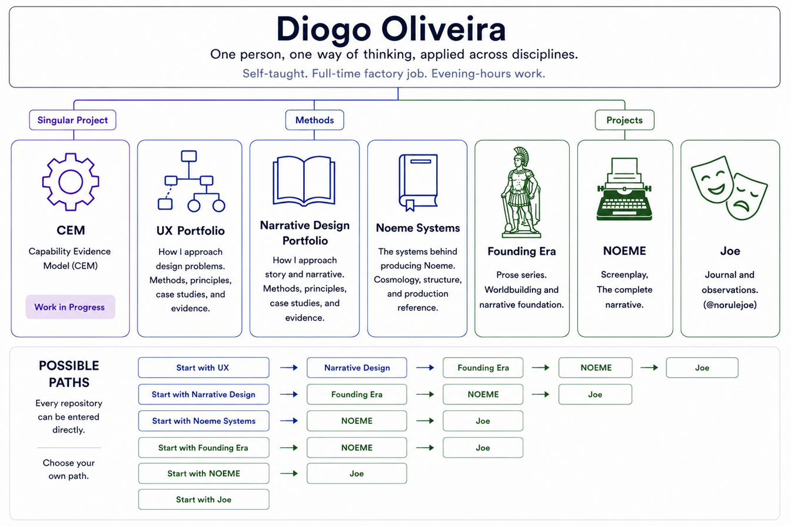

# Diogo Oliveira

## How to make complexity approachable.

That's the thread running through everything below.

Different mediums, different problems — story, systems, documentation, and interactive prototypes — but the same instinct applied each time: take something dense and find the exact amount of surface a person can hold at once, so the complexity underneath never feels like a wall.

---

## Who I Am

I work full-time at a glass factory.

Everything here was built alongside that — self-taught, in evenings and off-hours.

Across different disciplines, my work focuses on making complex systems approachable.

---

## How This Began

This started on **20 May 2026**, with **661 characters** and no characters in it at all — just a structure.

No story yet. No people.

Just a cycle:

> fragmentation enables experience → experience produces connection → connection trends toward unity → unity creates instability → instability triggers re-fragmentation

Everything documented across these repositories grew outward from that cycle.

First came characters.

Then a world.

Then methods.

Then systems for building methods.

The note below is where that process began.

---

## Where It Led

The original note gradually expanded into a connected body of work spanning methods, production systems, and applied projects.

---

## Where To Go From Here

Each repository documents a different part of the same body of work.

Choose any path.

### Singular Project

**[CEM →](https://github.com/VediRago/CEM)**  
Capability Evidence Model — a research framework arguing that capability should be evidenced rather than summarized.

### Methods

**[UX Portfolio →](https://github.com/VediRago/diogo-oliveira-ux)**  
Systems and UX thinking, discovered through narrative design.

**[Narrative Design Portfolio →](https://github.com/VediRago/diogo-oliveira-narrative-design)**  
The methodology behind the story work — how pressure, consequence, and world logic became a repeatable method.

**[Noeme Systems →](https://github.com/VediRago/diogo-oliveira-noeme-systems)**  
The production systems behind NOEME — cosmology, structure, blueprints, and production reference.

### Projects

**[NOEME →](https://github.com/VediRago/diogo-oliveira-noeme)**  
The pilot that started the ecosystem.

**[The Founding Era →](https://github.com/VediRago/diogo-oliveira-the-founding-era)**  
A second story built from the worldbuilding developed for NOEME.

**[Joe →](https://github.com/VediRago/diogo-oliveira-joe)**  
Journal and observations. (@norulejoe)

---

## Contact

GitHub: [VediRago](https://github.com/VediRago)
